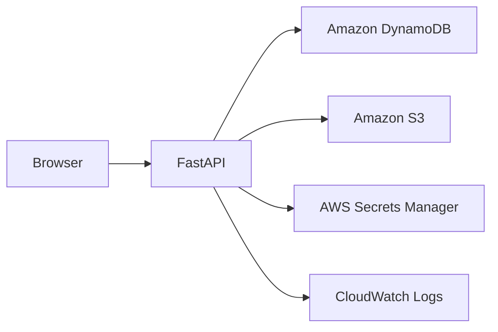

# AWS Architecture

The current implementation does not yet use a full AWS deployment. The application is designed to be compatible with an AWS-hosted future state.

## Current Implementation

- The backend uses DynamoDB as its persistence layer.
- DynamoDB settings are loaded through the central validated configuration module.
- The application runs locally and uses the standard AWS credential provider chain to access DynamoDB. It does not currently configure a local DynamoDB endpoint.
- The readiness endpoint calls DynamoDB `DescribeTable`; the runtime AWS identity therefore requires `dynamodb:DescribeTable` in addition to permissions needed for cocktail CRUD operations.

The repository does not currently provision or modify IAM policies. Local developer credentials and any future deployment role must supply the required permissions through the normal AWS operating model.

## Future Direction

A future version is expected to use:
- AWS Lambda or container-based hosting for the API
- Amazon DynamoDB as the primary data store
- Amazon Cognito for authentication
- Amazon S3 for image storage if media features are introduced

## Architectural Note

The repository keeps the AWS design intentionally lightweight at this stage so the implementation remains easy to evolve.

See [deployment.md](deployment.md) for the current operating model and the [product roadmap](../roadmap.md) for planned milestones.

## Future Architecture Diagram

This conceptual diagram illustrates services that may form part of a future AWS deployment. It does not describe the current local implementation.

- **Status:** Planned Architecture
- **Target:** Future Release

