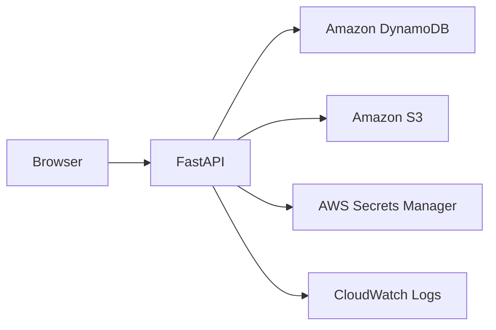

# AWS Architecture

The current implementation is ready to package for AWS Lambda but does not use
provisioned AWS hosting infrastructure or expose a deployed public endpoint.

## Current Implementation

- The backend uses DynamoDB as its persistence layer.
- DynamoDB settings are loaded through the central validated configuration module.
- The application runs locally and uses the standard AWS credential provider chain to access DynamoDB. It does not currently configure a local DynamoDB endpoint.
- The readiness endpoint calls DynamoDB `DescribeTable`; the runtime AWS identity therefore requires `dynamodb:DescribeTable` in addition to permissions needed for cocktail CRUD operations.
- Mangum exposes the FastAPI application through `src.lambda_handler.handler` for tested API Gateway HTTP API payload-v2 events.
- The repository builds and audits a CPython 3.14 Linux x86-64 Lambda ZIP containing runtime dependencies and static assets.
- GitHub Actions validates quality and invokes the extracted packaged handler in an isolated Linux environment without AWS credentials.

The repository does not currently provision Lambda, API Gateway, IAM roles,
CloudWatch configuration or other hosting resources. Local developer credentials
and any future deployment role must supply DynamoDB permissions through the normal
AWS operating model.

## Future Direction

A future deployment is expected to address:
- AWS Lambda hosting for the validated application package
- Amazon API Gateway integration
- least-privilege IAM execution roles
- CloudWatch logging, retention and operational configuration
- infrastructure as code
- Amazon DynamoDB as the primary data store
- Amazon Cognito for authentication
- Amazon S3 for image storage if media features are introduced

## Architectural Note

The repository keeps the AWS design intentionally lightweight at this stage so the implementation remains easy to evolve.

See [deployment.md](deployment.md) for the current operating model and the [product roadmap](../roadmap.md) for planned milestones.

## Future Architecture Diagram

This conceptual diagram illustrates services that may form part of a future AWS deployment. It does not describe the current local implementation.

- **Status:** Planned Architecture
- **Target:** Future Release

```mermaid
flowchart LR

Browser

Browser --> FastAPI

FastAPI --> DynamoDB

FastAPI --> S3

FastAPI --> Secrets

FastAPI --> CloudWatch

Secrets["AWS Secrets Manager"]

CloudWatch["CloudWatch Logs"]

DynamoDB["Amazon DynamoDB"]

S3["Amazon S3"]
```
