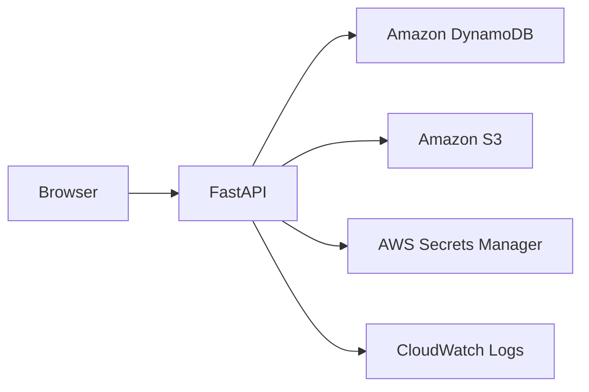

# AWS Architecture

The current implementation is ready to package for AWS Lambda but does not use
provisioned AWS hosting infrastructure or expose a deployed public endpoint.

## Current Implementation

- The backend uses DynamoDB as its persistence layer.
- DynamoDB settings are loaded through the central validated configuration module.
- The application runs locally and uses the standard AWS credential provider chain to access DynamoDB. It does not currently configure a local DynamoDB endpoint.
- The readiness endpoint calls DynamoDB `DescribeTable`; the runtime AWS identity therefore requires `dynamodb:DescribeTable` in addition to permissions needed for cocktail CRUD operations.
- Mangum exposes the FastAPI application through `src.lambda_handler.handler` for tested API Gateway HTTP API payload-v2 events.
- The repository builds and audits a CPython 3.14 Linux x86-64 Lambda ZIP containing runtime dependencies and static assets.
- GitHub Actions validates quality and invokes the extracted packaged handler in an isolated Linux environment without AWS credentials.

The repository does not currently provision Lambda, API Gateway, IAM roles,
CloudWatch configuration or other hosting resources. Local developer credentials
and any future deployment role must supply DynamoDB permissions through the normal
AWS operating model.

## Terraform Foundation

Terraform is the approved infrastructure-as-code approach for v0.6.0. Step 1 adds
repository structure and static validation only; it does not create AWS resources
or expose a public endpoint.

Terraform was selected because it provides declarative planning, mature AWS
provider coverage, reviewable state-aware changes and a direct path from local
validation to a future deployment workflow. AWS SAM is well suited to
serverless-only applications but is less suitable for the broader supporting
infrastructure expected here. AWS CDK would add a programming-language synthesis
layer and generated CloudFormation, while raw CloudFormation would require more
verbose AWS-specific templates. Terraform introduces state-management overhead,
so the repository defines that boundary explicitly from the outset.

The Terraform layout has two independent roots:

- `infra/terraform/bootstrap` owns only the future S3 state bucket and its
  protections. It starts with local state; migration of bootstrap state is
  deferred until a separately approved AWS execution step.
- `infra/terraform/environments/dev` holds the future development application
  configuration. Its partial S3 backend enables native S3 lockfiles and receives
  environment-specific backend values outside version control.

The planned state bucket enables versioning, SSE-S3 encryption, bucket-owner
enforced ownership, complete public-access blocking and a policy that denies
non-TLS requests. Terraform deletion protection is also configured. Application
state will use S3 native lockfiles through `use_lockfile = true`; no DynamoDB state
lock table is proposed.

The existing `Cocktails` DynamoDB table remains operational application data
outside Terraform ownership. Step 1 does not define, import, modify or transfer
ownership of that table.

## Future Direction

A future deployment is expected to address:
- AWS Lambda hosting for the validated application package
- Amazon API Gateway integration
- least-privilege IAM execution roles
- CloudWatch logging, retention and operational configuration
- Terraform-managed infrastructure and an approved remote-state workflow
- Amazon DynamoDB as the primary data store
- Amazon Cognito for authentication
- Amazon S3 for image storage if media features are introduced

## Architectural Note

The repository keeps the AWS design intentionally lightweight at this stage so the implementation remains easy to evolve.

See [deployment.md](deployment.md) for the current operating model and the [product roadmap](../roadmap.md) for planned milestones.

## Future Architecture Diagram

This conceptual diagram illustrates services that may form part of a future AWS deployment. It does not describe the current local implementation.

- **Status:** Planned Architecture
- **Target:** Future Release

```mermaid
flowchart LR

Browser

Browser --> FastAPI

FastAPI --> DynamoDB

FastAPI --> S3

FastAPI --> Secrets

FastAPI --> CloudWatch

Secrets["AWS Secrets Manager"]

CloudWatch["CloudWatch Logs"]

DynamoDB["Amazon DynamoDB"]

S3["Amazon S3"]
```
