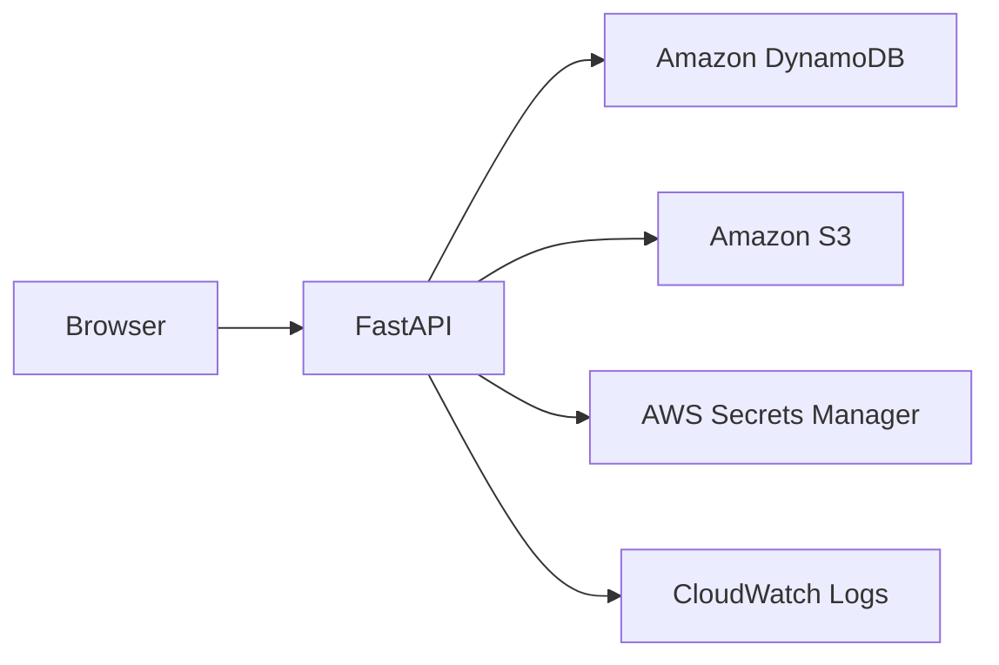

# AWS Architecture

The current implementation is ready to package for AWS Lambda but does not yet
deploy application hosting infrastructure or expose a public endpoint.

## Current Implementation

- The backend uses DynamoDB as its persistence layer.
- DynamoDB settings are loaded through the central validated configuration module.
- The application runs locally and uses the standard AWS credential provider chain to access DynamoDB. It does not currently configure a local DynamoDB endpoint.
- The readiness endpoint calls DynamoDB `DescribeTable`; the runtime AWS identity therefore requires `dynamodb:DescribeTable` in addition to permissions needed for cocktail CRUD operations.
- Mangum exposes the FastAPI application through `src.lambda_handler.handler` for tested API Gateway HTTP API payload-v2 events.
- The repository builds and audits a CPython 3.14 Linux x86-64 Lambda ZIP containing runtime dependencies and static assets.
- GitHub Actions validates quality and invokes the extracted packaged handler in an isolated Linux environment without AWS credentials.

The repository does not currently provision Lambda, API Gateway, IAM roles,
CloudWatch configuration or other hosting resources. Local developer credentials
and any future deployment role must supply DynamoDB permissions through the normal
AWS operating model.

## Terraform Foundation

Terraform is the approved infrastructure-as-code approach for v0.6.0. Step 6A
adds remote-backend declarations and documentation only; it does not change AWS
resources, initialize a remote backend, migrate state or expose a public endpoint.

Terraform was selected because it provides declarative planning, mature AWS
provider coverage, reviewable state-aware changes and a direct path from local
validation to a future deployment workflow. AWS SAM is well suited to
serverless-only applications but is less suitable for the broader supporting
infrastructure expected here. AWS CDK would add a programming-language synthesis
layer and generated CloudFormation, while raw CloudFormation would require more
verbose AWS-specific templates. Terraform introduces state-management overhead,
so the repository defines that boundary explicitly from the outset.

The Terraform layout has two independent roots:

- `infra/terraform/bootstrap` owns only the protected S3 state bucket and its
  protections. It declares a partial encrypted S3 backend for eventual adoption,
  but its authoritative state remains local.
- `infra/terraform/environments/dev` holds the future development application
  configuration. Its partial encrypted S3 backend enables native S3 lockfiles,
  but its backend and state remain uninitialized.

Bucket, key and region values continue to be supplied through ignored
`*.tfbackend` files. The proposed state keys are `bootstrap/terraform.tfstate` and
`environments/dev/terraform.tfstate`. Both backend declarations set
`encrypt = true` and `use_lockfile = true`.

Backend initialization and bootstrap-state migration remain gated on separate
Step 6B approval. That step will define permanent least-privilege access to the
exact state objects and separate `s3:GetObject`, `s3:PutObject` and
`s3:DeleteObject` permissions for their native `.tflock` objects.

The state bucket enables versioning, SSE-S3 encryption, bucket-owner
enforced ownership, complete public-access blocking and a policy that denies
non-TLS requests. Terraform deletion protection is also configured. Application
state will use S3 native lockfiles through `use_lockfile = true`; no DynamoDB state
lock table is proposed.

The existing `Cocktails` DynamoDB table remains operational application data
outside Terraform ownership. The Terraform configuration does not define, import,
modify or transfer ownership of that table.

## Defined AWS Runtime — Not Deployed

The v0.6.0 development Terraform root now defines a private Lambda runtime layer,
but none of these resources has been planned against AWS or deployed:

- the existing `Cocktails` table is resolved through a data source and remains
  outside Terraform ownership;
- a dedicated Lambda execution role trusts only `lambda.amazonaws.com`;
- table permissions are limited to `DescribeTable`, `Scan` and `GetItem`, with
  `PutItem` and `DeleteItem` included only when `ALLOW_MUTATIONS` is enabled;
- CloudWatch Logs permissions allow only `CreateLogStream` and `PutLogEvents` for
  the explicitly managed Lambda log group;
- a Python 3.14, x86-64 ZIP function uses the audited package and publishes
  immutable versions;
- a `live` alias points to the version published by Terraform; and
- error and throttling alarms observe the managed function.

The Lambda runtime uses Amazon Linux 2023. Terraform configures `APP_NAME`,
`APP_VERSION`, `APP_ENV`, `TABLE_NAME`, `LOG_LEVEL` and `ALLOW_MUTATIONS`.
Lambda supplies the reserved `AWS_REGION` variable automatically, and the existing
application reads it without application changes.

The log group is named for the Lambda function and retains logs for 14 days. Each
alarm triggers when the five-minute sum is at least one and treats missing data as
non-breaching. No notification actions are attached, so the alarms will be visible
in CloudWatch but will not notify anyone.

The `live` alias establishes a rollback boundary: an emergency rollback may repoint
the alias to an earlier immutable version, but Terraform configuration and state
must then be reconciled through an approved workflow.

The development root also defines an unauthenticated API Gateway HTTP API using
payload format 2.0 and an auto-deploying `$default` stage. The stage avoids a URL
prefix; it is not a `$default` catch-all route. Only an explicit allowlist of
twelve GET routes is connected to the `live` Lambda alias:

- `/`, `/favicon.ico`, `/static/{proxy+}`, `/docs` and `/openapi.json`;
- `/health`, `/health/live` and `/health/ready`; and
- `/cocktails`, `/cocktails/{cocktail_id}`, `/cocktails/html` and
  `/cocktails/html/{cocktail_id}`.

The invocation permission is qualified to the `live` alias and restricted to GET
requests from this API. Public read-only behaviour is reinforced in three layers:
Terraform defines no mutation or catch-all route, its lifecycle precondition
requires `ALLOW_MUTATIONS=false`, and the application continues to reject mutation
requests while omitting those operations from OpenAPI when mutations are disabled.
This setting is a fail-closed safety control, not authentication.

The stage applies best-effort default throttling of five requests per second with
a burst of ten. Throttling limits load but is not authentication, authorization or
abuse prevention. Structured access logs retain request and response metadata for
14 days without bodies, query strings, cookies, source IP addresses or user-agent
values. An HTTP API 5xx alarm has no notification action.

CORS is intentionally absent because the current HTML and API share one origin.
Public accessibility does not grant cross-origin browser access; command-line and
other non-browser clients are unaffected. A future separately hosted browser
client must use an explicit origin allowlist rather than a wildcard.
No custom domain, Cognito authorizer, WAF, deployment automation or public endpoint
has been created. These resources are definitions only and have not been planned
against AWS or applied.

## Future Direction

A future deployment is expected to address:
- AWS Lambda hosting for the validated application package
- an approved AWS-backed review and deployment of the defined Lambda, API Gateway,
  IAM and CloudWatch resources
- Terraform-managed infrastructure and an approved remote-state workflow
- CORS with an explicit origin allowlist when a browser client requires it
- authentication, a custom domain, WAF and notification routing when justified
- Amazon DynamoDB as the primary data store
- Amazon Cognito for authentication
- Amazon S3 for image storage if media features are introduced

## Architectural Note

The repository keeps the AWS design intentionally lightweight at this stage so the implementation remains easy to evolve.

See [deployment.md](deployment.md) for the current operating model and the [product roadmap](../roadmap.md) for planned milestones.

## Future Architecture Diagram

This conceptual diagram illustrates services that may form part of a future AWS deployment. It does not describe the current local implementation.

- **Status:** Planned Architecture
- **Target:** Future Release

```mermaid
flowchart LR

Browser

Browser --> FastAPI

FastAPI --> DynamoDB

FastAPI --> S3

FastAPI --> Secrets

FastAPI --> CloudWatch

Secrets["AWS Secrets Manager"]

CloudWatch["CloudWatch Logs"]

DynamoDB["Amazon DynamoDB"]

S3["Amazon S3"]
```
