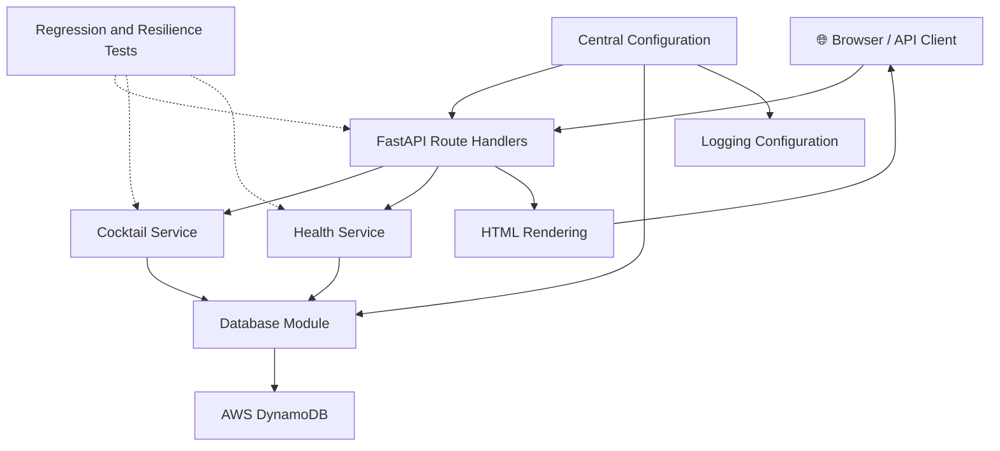
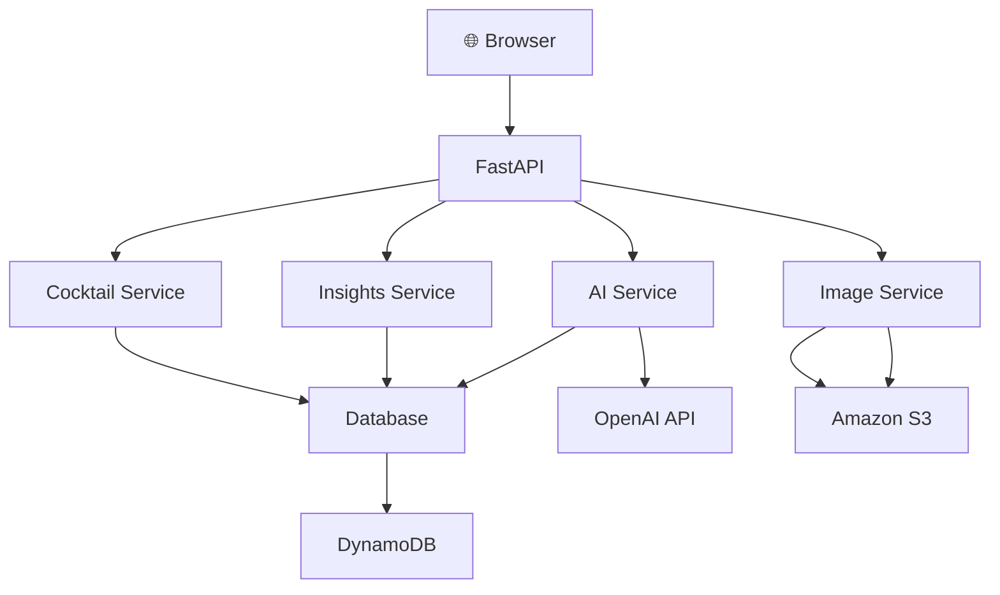
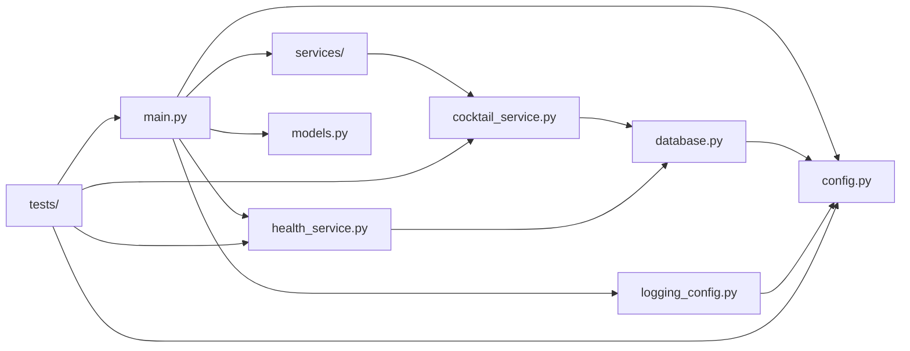

# Architecture Overview

This document gives the high-level shape of the Cocktail AI App and points to the more detailed architecture pages in this folder.

## Current Implementation

The project is currently a Python FastAPI application with:
- a small HTTP API for cocktail data
- HTML views served from the same application
- a service layer that separates business logic from route handlers
- separate liveness and DynamoDB readiness checks
- immutable, validated application configuration
- named application logging with service-owned operational events
- DynamoDB as the persistence layer
- regression and resilience tests
- static CSS and a browser favicon served by the application

## Current Architecture Diagram

- **Status:** Current Implementation
- **Version:** 0.4.0
- **Last Updated:** 2026-07-23

## Future Direction

The long-term direction is a cloud-native, AWS-based application with AI-assisted features. The current implementation is intentionally small and local-first so the core architecture can evolve without unnecessary complexity.

## Future Architecture

- **Status:** Planned Architecture
- **Target:** Future Release

## Project Structure

- **Status:** Current Implementation
- **Version:** 0.4.0
- **Last Updated:** 2026-07-23

## Main Components

- FastAPI application: request handling and HTML rendering
- Cocktail service: DynamoDB-backed CRUD operations and business logic
- Health service: DynamoDB readiness checks
- Central configuration: immutable, validated application and infrastructure settings
- DynamoDB table: persistent storage for cocktail records
- Logging: named application logging with severity and ownership policies
- Tests: regression and resilience coverage without live AWS calls

## Documentation Map

- [AWS architecture](aws.md): current AWS integration and planned hosting direction
- [Deployment](deployment.md): current local operating model and deployment milestone
- [Data model](data-model.md): persisted cocktail record shape
- [Product roadmap](../roadmap.md): planned evolution
- [AI-assisted development workflow](../development/ai-development-workflow.md): collaboration roles and supporting tools
- [Engineering log](../development/engineering-log.md): significant implementation history and decisions

For setup and project-wide delivery standards, see the [setup guide](../setup.md) and [coding standards](../development/coding-standards.md).
