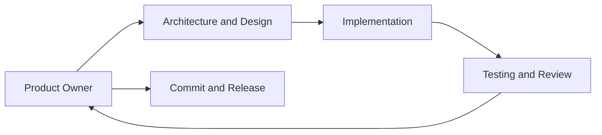

# AI-Assisted Development Workflow

## Purpose

This document describes the collaboration roles used for AI-assisted engineering in this repository. [AGENTS.md](../../AGENTS.md) remains the source of truth for engineering governance, delivery workflow, and approval requirements.

## Roles and Responsibilities

| Role | Responsibility |
|------|----------------|
| **Tom Stayner** | Product owner, engineering lead, and final reviewer |
| **ChatGPT** | Architecture discussion, technical mentoring, documentation, and design review support |
| **Codex** | Implementation, refactoring, test development, and documentation maintenance |

## Engineering Tools

| Tool | Current use |
|------|-------------|
| **GitHub** | Version control, issues, discussions, and releases |
| **Pytest** | Regression verification |
| **Ruff / Black** | Installed development tools; automated enforcement is not yet configured |

## Collaboration Loop

- **Status:** Current Development Workflow
- **Version:** 0.3.0
- **Last Updated:** 2026-07-14

## Related Documentation

- [Engineering governance](../../AGENTS.md)
- [Coding standards](coding-standards.md)
- [Engineering log](engineering-log.md)
- [Changelog](changelog.md)
