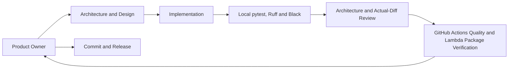

# AI-Assisted Development Workflow

## Purpose

This document describes the collaboration roles used for AI-assisted engineering in this repository. [AGENTS.md](../../AGENTS.md) remains the source of truth for engineering governance, delivery workflow, and approval requirements.

## Roles and Responsibilities

| Role | Responsibility |
|------|----------------|
| **Tom Stayner** | Product owner, engineering lead, and final reviewer |
| **ChatGPT** | Architecture discussion, technical mentoring, documentation, and design review support |
| **Codex** | Implementation, refactoring, test development, and documentation maintenance |

## Engineering Tools

| Tool | Current use |
|------|-------------|
| **GitHub** | Version control, issues, discussions, and releases |
| **Pytest** | Local regression verification and GitHub Actions test execution |
| **Ruff / Black** | Local linting and formatting checks repeated by GitHub Actions |
| **Lambda package checks** | Linux package build, structural audit, and isolated packaged-handler smoke verification in CI |

## Collaboration Loop

- **Status:** Current Development Workflow
- **Version:** 0.5.0
- **Last Updated:** 2026-07-27

```mermaid
flowchart LR
    PO["Product Owner"] --> ARCH["Architecture and Design"]
    ARCH --> ENG["Implementation"]
    ENG --> LOCAL["Local pytest, Ruff and Black"]
    LOCAL --> REVIEW["Architecture and Actual-Diff Review"]
    REVIEW --> CI["GitHub Actions Quality and Lambda Package Verification"]
    CI --> PO
    PO --> RELEASE["Commit and Release"]
```

Automated verification supports review but does not replace architectural
assessment, actual-diff inspection or Product Owner authorization. Commits, pushes,
pull requests, merges, tags and releases remain controlled by the approval workflow
defined in `AGENTS.md`.

## Related Documentation

- [Engineering governance](../../AGENTS.md)
- [Coding standards](coding-standards.md)
- [Engineering log](engineering-log.md)
- [Changelog](changelog.md)
